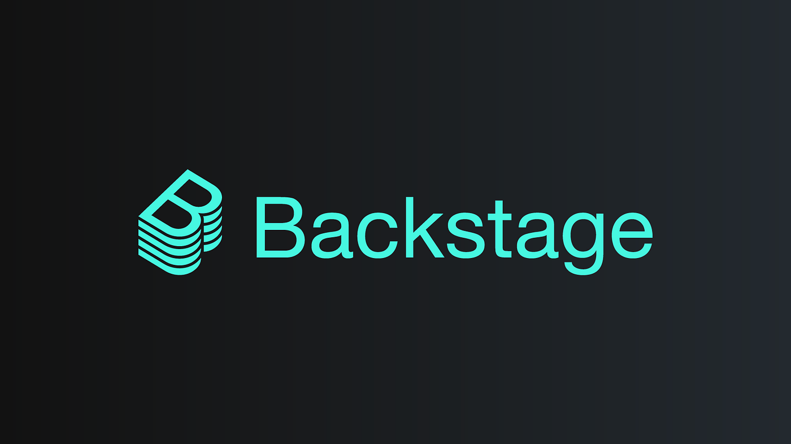

# Backstage
Information about Backstage framework

## What is the problem?
Cloud-native organizations benefit from developer autonomy for faster deliveries and talent retention. However, autonomy can lead to fragmentation, posing challenges in resource accessibility, onboarding, and oversight.

In cloud-native environments, discoverability is crucial for navigating vast ecosystems. Manual methods like word-of-mouth often prevail due to the challenges of maintaining and accessing up-to-date documentation. Automation is key to achieving reliable discoverability.

`The issue isn't just creating the document, but also keeping it current and making sure everyone knows about it.`

## What is a developer portal

Developer Portals serve as centralized hubs for developers to explore and contribute to their ecosystem while balancing autonomy and discoverability. They automate discoverability through software catalogs, tracking ownership, dependencies, and system models, enhancing productivity and insights for teams and leadership.

`Developer Portals exist to balance Developer Autonomy and Discoverability`
`Instead of developers having to raise a ticket to ask for infrastructure to deploy a new service, DevOps teams can offer templates that set up the infrastructure with just one click in their Developer Portal.`

## What is Backstage?

Backstage emerged from Spotify's need to manage the complexity of rapid growth and increasing microservices. They developed System-Z, a catalog integrating service metadata, documentation, and infrastructure options. By open-sourcing it, Backstage has evolved into a widely adopted solution for managing microservices across organizations.

`The primary difficulty faced by Spotify's engineering team was identifying which services were active in production and determining who was accountable for each of them.`

Backstage aims to enhance Developer Experience (DX) by promoting autonomy and ownership. It aggregates information from various sources to aid developers in navigating their services efficiently. While it doesn't replace existing tools, it encourages teams to contribute integrations and take ownership of their components for effective usage.

`Backstage consolidates information about your services from various sources, making it simpler for developers to navigate through them.`

`For Backstage to work efficiently, every software component needs to be owned by one team responsible for keeping its information current.`

Backstage is not a ready-to-use product but a customizable collection of tools and libraries for building your Developer Portal. With its core and extensive plugin ecosystem, organizations can tailor Backstage to their needs and extend its functionality as required. Starting with the CLI, users can easily add or remove plugins to suit their preferences.

`Backstage comprises tools and libraries that enable the creation of a custom Developer Portal. This flexibility is advantageous as it allows adaptation to suit your organization's specific setup, regardless of its complexity.`

The Backstage instance is a Node/React app utilizing Backstage's core libraries. It operates on a three-layer model: Core (maintained by the Backstage team), App (the Developer Portal you create), and Plugins (installed to extend functionality).

### Functionalities

#### Software Catalog

Backstage's Software Catalog is a crucial feature, centralizing all software assets like websites, APIs, and libraries in one directory. It tracks metadata, ownership, and dependencies, facilitating management and discoverability. The flexible Catalog categorizes entities by kind and type, powered by YAML files stored with codebases or authoritative sources. Ownership and dependencies are meticulously tracked, allowing insights like orphaned entities and maturity levels.

`The Software Catalog in Backstage is the most requested feature of the framework and serves as the foundation for all other functionalities.`

#### Scaffolder

Backstage's Scaffolder facilitates onboarding and promotes standardization by allowing developers to execute software templates, initializing repositories with predefined settings. It empowers new engineers to quickly start development with deploy-ready services, enhancing productivity and familiarity with tools. Templates, defined in YAML files, generate UIs in the Scaffolder and promote discoverability and standardization through integration with the Catalog.

#### TechDocs

Backstage's TechDocs provides a centralized documentation hub by transforming markdown files into static pages. Following the principle of staying close to the source code, TechDocs retrieves markdown files from repositories, generates and publishes static pages automatically. Developers can focus on writing while TechDocs handles gathering sources, building pages, and providing flexible build options.

#### Kubernetes

Backstage includes a Kubernetes plugin to visualize the state of service clusters, aiding in understanding their health across development, staging, and production environments. Integrated with the Catalog, it displays cluster information associated with registered services, sourced either from existing Catalog data or fetched directly from Kubernetes suppliers like EKS.

#### Search

Backstage's recent addition, Search, empowers developers to explore their ecosystem by leveraging a customizable search engine. It supports various engines, with ElasticSearch as the official choice, and offers flexibility in query translation and result customization. Search operates by searching documents representing entities, documentation pages, etc., collected via Collators, which define, index, and collect documents. Collators for the Catalog, TechDocs, and Stack Overflow are available, with the option to define custom ones.

#### Others

Backstage offers core plugins developed by its team, with additional community plugins extending features like the Software Catalog and integrating with external services. Users can create custom plugins for internal use or community sharing.

### Adopters

Backstage, though new, is embraced by over a hundred organizations like HP and Netlify for streamlining developer workflows. Its customization and scalability make it valuable for enterprises and scale-ups alike.

### Technology Stack

When considering Backstage for your developer portal, note its technology stack. You'll work extensively with YAML for metadata and React for UI customization. Node.js powers Backstage's backend, while TypeScript is heavily used. Docker aids local development, and YARN manages packages. Understanding monorepos and Semantic Versioning will also be beneficial.

### Self-Hosted Backstage

The default approach for adopting Backstage involves deploying it similarly to other services, often using Kubernetes on AWS or Azure. While Spotify found success with Google Cloud, Backstage is flexible regarding deployment preferences. Self-hosting offers extensive customization but requires ongoing effort to keep up with updates and maintenance, potentially necessitating dedicated engineering resources.

### Managed Backstage

Roadie.io, an official Backstage partner, offers a commercial managed and hosted Backstage solution, particularly popular among scale-ups looking to offload maintenance and customization burdens. Managed Backstage provides a production-ready instance with integrations and updates managed via UI, reducing maintenance needs. However, it offers less flexibility compared to self-hosted options.

### Official Partners

For additional support in setting up Backstage and integrating it into your Developer Experience, consider engaging with official partners like:
* [Frontside](https://frontside.com/backstage/)  for Developer Experience consulting
* [Thoughtworks](https://www.thoughtworks.com/) for Digital Transformation consulting
* [VMware](https://tanzu.vmware.com/tanzu) for Backstage integration within its platform solution.


### Local  Installation

0) Prerequisites: Node, Yarn and git.
1) Execute the command `npx @backstage/create-app` 
2) cd to the new created folder and then `yarn dev`

Upon navigating to the directory, you'll encounter a structure comprising packages for frontend (app) and backend, each with its own package.json file. Backstage operates as a monorepo, allowing independent deployment of frontend and backend components, managed via lerna.json. The catalog-info.yaml file adds Backstage to the Software Catalog. The app-config.yaml file serves as the main configuration, defining instance details and integrations.

`By default, Backstage uses an in-memory database, which can be inconvenient for local development as data is lost when the server stops. Let's switch to PostgreSQL for a more reliable solution.`

3) running postgress with docker (you can install postgress directly on your computer) 

`docker run -d -p 5432:5432  -v /path/on/host:/var/lib/postgresql/data --name my_postgres -e POSTGRES_PASSWORD=mysecretpassword postgres:latest`

4) Add the following configuration on the file app-config.local.yaml

```yaml
backend:
  database:
    connection:
      client: pg
      host: localhost
      port: 5432
      user: postgres
      # The password you set earlier
      password: mysecretpassword
```

`For authentication in your Developer Portal, Backstage supports eleven providers such as Okta, Google, and custom OAuth 2 proxies. To enable GitHub authentication, create a GitHub OAuth App and add its credentials in app-config.local.yaml. Then, set up a Sign In button in Backstage's frontend.`

5) Register a new OAuth application on [github](https://github.com/settings/applications/new), please be sure to set this url `http://local:3000` in the homepage URL field and this `http://localhost:7007/api/auth/github/handler/frame` for the Authorization callback URL field

6) Add the following code to the app-config.local.yaml file (Use the client id and client secret that you got on the github page)

```yaml
auth:
  environment: development
  providers:
    github:
      development:
        clientId: YOUR-CLIENT-ID
        clientSecret: YOUR-CLIENT-SECRET
```

7) Replace the code on the file `packages/app/src/App.tsx` for the following code

```js
import React from 'react';
import { Navigate, Route } from 'react-router-dom';
import { apiDocsPlugin, ApiExplorerPage } from '@backstage/plugin-api-docs';
import {
  CatalogEntityPage,
  CatalogIndexPage,
  catalogPlugin,
} from '@backstage/plugin-catalog';
import {
  CatalogImportPage,
  catalogImportPlugin,
} from '@backstage/plugin-catalog-import';
import { ScaffolderPage, scaffolderPlugin } from '@backstage/plugin-scaffolder';
import { orgPlugin } from '@backstage/plugin-org';
import { SearchPage } from '@backstage/plugin-search';
import { TechRadarPage } from '@backstage/plugin-tech-radar';
import {
  TechDocsIndexPage,
  techdocsPlugin,
  TechDocsReaderPage,
} from '@backstage/plugin-techdocs';
import { TechDocsAddons } from '@backstage/plugin-techdocs-react';
import { ReportIssue } from '@backstage/plugin-techdocs-module-addons-contrib';
import { UserSettingsPage } from '@backstage/plugin-user-settings';
import { apis } from './apis';
import { entityPage } from './components/catalog/EntityPage';
import { searchPage } from './components/search/SearchPage';
import { Root } from './components/Root';

import { AlertDisplay, OAuthRequestDialog } from '@backstage/core-components';
import { createApp } from '@backstage/app-defaults';
import { AppRouter, FlatRoutes } from '@backstage/core-app-api';
import { CatalogGraphPage } from '@backstage/plugin-catalog-graph';
import { RequirePermission } from '@backstage/plugin-permission-react';
import { catalogEntityCreatePermission } from '@backstage/plugin-catalog-common/alpha';
import { githubAuthApiRef } from '@backstage/core-plugin-api';
import { SignInProviderConfig, SignInPage } from '@backstage/core-components';
const githubProvider: SignInProviderConfig = {
  id: 'github-auth-provider',
  title: 'GitHub',
  message: 'Sign in using GitHub',
  apiRef: githubAuthApiRef,
};

const app = createApp({
  apis,
  components: {
    SignInPage: props => (
      <SignInPage
        {...props}
        auto
        provider={githubProvider}
      />
    ),
  },
  bindRoutes({ bind }) {
    bind(catalogPlugin.externalRoutes, {
      createComponent: scaffolderPlugin.routes.root,
      viewTechDoc: techdocsPlugin.routes.docRoot,
      createFromTemplate: scaffolderPlugin.routes.selectedTemplate,
    });
    bind(apiDocsPlugin.externalRoutes, {
      registerApi: catalogImportPlugin.routes.importPage,
    });
    bind(scaffolderPlugin.externalRoutes, {
      registerComponent: catalogImportPlugin.routes.importPage,
      viewTechDoc: techdocsPlugin.routes.docRoot,
    });
    bind(orgPlugin.externalRoutes, {
      catalogIndex: catalogPlugin.routes.catalogIndex,
    });
  },
});

const routes = (
  <FlatRoutes>
    <Route path="/" element={<Navigate to="catalog" />} />
    <Route path="/catalog" element={<CatalogIndexPage />} />
    <Route
      path="/catalog/:namespace/:kind/:name"
      element={<CatalogEntityPage />}
    >
      {entityPage}
    </Route>
    <Route path="/docs" element={<TechDocsIndexPage />} />
    <Route
      path="/docs/:namespace/:kind/:name/*"
      element={<TechDocsReaderPage />}
    >
      <TechDocsAddons>
        <ReportIssue />
      </TechDocsAddons>
    </Route>
    <Route path="/create" element={<ScaffolderPage />} />
    <Route path="/api-docs" element={<ApiExplorerPage />} />
    <Route
      path="/tech-radar"
      element={<TechRadarPage width={1500} height={800} />}
    />
    <Route
      path="/catalog-import"
      element={
        <RequirePermission permission={catalogEntityCreatePermission}>
          <CatalogImportPage />
        </RequirePermission>
      }
    />
    <Route path="/search" element={<SearchPage />}>
      {searchPage}
    </Route>
    <Route path="/settings" element={<UserSettingsPage />} />
    <Route path="/catalog-graph" element={<CatalogGraphPage />} />
  </FlatRoutes>
);

export default app.createRoot(
  <>
    <AlertDisplay />
    <OAuthRequestDialog />
    <AppRouter>
      <Root>{routes}</Root>
    </AppRouter>
  </>,
);
```

With this, your local setup of Backstage with PostgreSQL and GitHub authentication is complete!

### Using the Catalog

The primary entities in your Backstage instance are components, representing software components like services and libraries. These are described with metadata in YAML files stored in their respective repositories. To add them to the Catalog, you can manually register them via the UI or set up an entity processor to discover YAML files in your source code management system. Backstage fetches YAML files from registered locations, requiring repository access with an access token for periodic updates to keep the Catalog current.


In Backstage, components are entities of kind Component, requiring additional data like type, lifecycle, and owner. This is described in a YAML file straightforwardly. For instance, registering a public-facing website would entail specifying its name, description, type (e.g., website), lifecycle (e.g., production), and owner (e.g., tracking-team). Mandatory fields include apiVersion, kind, and metadata.name, with type, lifecycle, and owner specified in spec. Default recognized types are website, service, and library, with lifecycles including production, experimental, and deprecated. YAML files should be added to the component's repository on the default branch, following the convention of naming them catalog-info.yaml for consistency.

```yaml
apiVersion: backstage.io/v1alpha1
kind: Component
metadata:
  name: daniel-web
  description: Information about Daniel Cifuentes
spec:
  type: website
  lifecycle: production
  owner: tracking-team
```

While you have the freedom to name your YAML file as you prefer, Backstage suggests using the name catalog-info.yaml for consistency.


